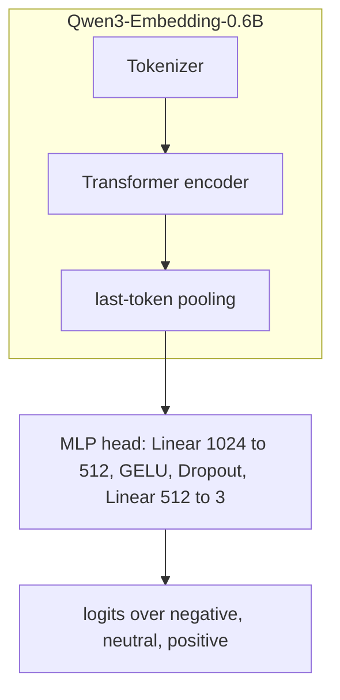

# Qwen3-Embedding-0.6B Machine Unlearning for Russian Sentiment Classification

Comparative study of machine unlearning methods applied to [Qwen/Qwen3-Embedding-0.6B](https://huggingface.co/Qwen/Qwen3-Embedding-0.6B) fine-tuned for three-class sentiment classification on Russian product reviews about women's clothing. The pipeline trains reference **gold** and **original** models, applies four unlearning objectives on a designated forget set, logs experiments with MLflow, uploads checkpoints to [pymlex/qwen3-embedding-0.6b-unlearning](https://huggingface.co/pymlex/qwen3-embedding-0.6b-unlearning), and reports multiclass Matthews Correlation Coefficient across retain and forget partitions.

## Overview

The dataset contains 90,000 automatically labelled reviews with three balanced classes: `negative`, `neutral`, and `positive`. Each class contributes 30,000 examples. The source corpus is the RuReviews women's clothing subset described in [sismetanin/rureviews](https://github.com/sismetanin/rureviews/tree/master). The project file `women_clothing_accessories.csv` is a comma-separated local export used for training and evaluation.

Machine unlearning targets the **neutral** class. The retain set $D_r$ contains `positive` and `negative` training examples. The forget set $D_f$ contains all `neutral` training examples. The gold model is trained on the full three-class training split and kept frozen as the reference distribution for KL and agreement metrics.

## Dataset

Token lengths were computed with the [Qwen/Qwen3-Embedding-0.6B](https://huggingface.co/Qwen/Qwen3-Embedding-0.6B) tokenizer over all 90,000 reviews without truncation.

| Statistic | Tokens |
| --- | --- |
| Mean | 49.3 |
| Median | 35 |
| p95 | 139 |
| p99 | 240 |
| Maximum | 838 |

The corpus $p_{99}$ token length is 240. The sequence budget is fixed at `max_length = 256`. Reviews above this length are truncated during training and inference.


Data partitioning uses 1,000 test and 1,000 validation examples per class. All remaining examples form the training split.

| Split | Size per class | Total | Role |
| --- | --- | --- | --- |
| Train | 28,000 | 84,000 | Optimisation |
| Valid | 1,000 | 3,000 | Baseline validation MCC every 0.5 epoch |
| Test | 1,000 | 3,000 | Final evaluation and confusion matrices |

After the class split, retain training contains 56,000 reviews and forget training contains 28,000 neutral reviews.

## Model Architecture



Let $x$ denote a review, $h_{\phi}(x) \in \mathbb{R}^{1024}$ the pooled embedding from the encoder with parameters $\phi$, and $g_{\psi}$ the MLP head with parameters $\psi$. The classifier logits are

$$f_{\theta}(x) = g_{\psi}\bigl(h_{\phi}(x)\bigr), \qquad \theta = (\phi, \psi).$$

Class probabilities:

$$p_{\theta}(y \mid x) = \mathrm{softmax}\bigl(f_{\theta}(x)\bigr)_{y}.$$

## Classification Metric

All classification quality numbers use the **multiclass Matthews Correlation Coefficient**. For confusion matrix $C \in \mathbb{N}^{K \times K}$ with $K=3$, define row sums $t_k = \sum_j C_{kj}$, column sums $p_k = \sum_i C_{ik}$, and total $n = \sum_{i,j} C_{ij}$. The multiclass MCC is

$$\mathrm{MCC} = \frac{n \sum_k C_{kk} - \sum_k t_k p_k}{\sqrt{\left(n^2 - \sum_k t_k^2\right)\left(n^2 - \sum_k p_k^2\right)}}.$$

$\mathrm{MCC} \in [-1,1]$. Values near 1 indicate strong correlation between predictions and ground truth across all classes. Values near 0 correspond to chance-level multiclass predictions.

## Unlearning Evaluation Metrics

For each unlearned model with parameters $\theta$ and frozen gold model $\theta_g$.

| Metric | Target |
| --- | --- |
| `model_retain_mcc` | Close to gold on retain test split, drop undesirable |
| `model_forget_mcc` | Low on forget test split, model forgot the forget class |
| `gold_kl_retain` | 0.0 |
| `gold_kl_forget` | 0.0 |
| `gold_agree_retain` | Maximal agreement with gold on retain test split |
| `gold_agree_forget` | Context-dependent agreement with gold on forget test split |

Retain-set KL divergence against gold:

$$\text{gold\_kl\_retain} = \mathbb{E}_{x \sim {D_r}^{\text{test}}} \operatorname{KL}\!\left(p_{\theta_g}(\cdot \mid x) \,\middle\|\, p_{\theta}(\cdot \mid x)\right)$$

Forget-set KL divergence against gold:

$$\text{gold\_kl\_forget} = \mathbb{E}_{x \sim {D_f}^{\text{test}}} \operatorname{KL}\!\left(p_{\theta_g}(\cdot \mid x) \,\middle\|\, p_{\theta}(\cdot \mid x)\right)$$

Retain-set prediction agreement with gold:

$$\text{gold\_agree\_retain} = \mathbb{E}_{x \sim {D_r}^{\text{test}}} \mathbf{1}\!\left[\arg\max_{y} p_{\theta}(y \mid x) = \arg\max_{y} p_{\theta_g}(y \mid x)\right]$$

Forget-set prediction agreement with gold:

$$\text{gold\_agree\_forget} = \mathbb{E}_{x \sim {D_f}^{\text{test}}} \mathbf{1}\!\left[\arg\max_{y} p_{\theta}(y \mid x) = \arg\max_{y} p_{\theta_g}(y \mid x)\right]$$

Confusion matrices are saved for **gold**, **original**, and the **best unlearning** checkpoint selected by lowest `model_forget_mcc` among methods with `model_retain_mcc` at least 90% of gold retain MCC.

## Baseline Training

Both gold and original models are trained for two epochs on the full three-class training split with cross-entropy loss:

$$L_{\mathrm{CE}}(\theta) = \mathbb{E}_{(x,y)\sim D_{\mathrm{train}}}\bigl[-\log p_{\theta}(y \mid x)\bigr]$$

Metrics are computed at epoch $0$ before any gradient step and every $0.5$ epoch on the validation split. After training, gold weights are stored as the reference model. Original weights are an identical copy used as the starting point for unlearning.

$$\theta \leftarrow \theta - \eta \nabla_{\theta} L_{\mathrm{CE}}(\theta)$$

## Unlearning Methods

Cross-entropy on a labelled example:

$$\ell_{\mathrm{CE}}(x,y;\theta) = -\log p_{\theta}(y \mid x).$$

The original checkpoint is denoted by $\theta_0$.

### Retain Fine-Tuning

$$L_{\mathrm{retain}}(\theta) = \mathbb{E}_{(x,y)\sim D_r}\bigl[\ell_{\mathrm{CE}}(x,y;\theta)\bigr]$$

$$\theta \leftarrow \theta - \eta \nabla_{\theta} L_{\mathrm{retain}}(\theta)$$

### DPO-like

Score for labelled example $(x,y)$:

$$s_{\theta}(x,y) = \beta\left(\log p_{\theta}(y \mid x) - \log p_{\theta_0}(y \mid x)\right)$$

For retain pair $(x_r, y_r)$ and forget pair $(x_f, y_f)$:

$$s_r = s_{\theta}(x_r, y_r), \qquad s_f = s_{\theta}(x_f, y_f)$$

$$L_{\mathrm{DPO}}(\theta) = -\mathbb{E}\bigl[\log \sigma(s_r - s_f)\bigr]$$

$$\theta \leftarrow \theta - \eta \nabla_{\theta} L_{\mathrm{DPO}}(\theta)$$

with $\beta = 0.1$.

### RMU with Uniform Refusal Target

Uniform refusal distribution over $K=3$ classes:

$$u(y) = \frac{1}{K}$$

$$L_{\mathrm{retain}}^{\mathrm{RMU}}(\theta) = \mathbb{E}_{(x,y)\sim D_r}\bigl[\ell_{\mathrm{CE}}(x,y;\theta)\bigr] + 0.5\,\mathbb{E}_{x\sim D_r}\operatorname{KL}\!\left(p_{\theta_0}(\cdot \mid x) \,\middle\|\, p_{\theta}(\cdot \mid x)\right)$$

$$L_{\mathrm{refusal}}(\theta) = \mathbb{E}_{x\sim D_f}\operatorname{KL}\!\left(u(\cdot) \,\middle\|\, p_{\theta}(\cdot \mid x)\right)$$

$$L_{\mathrm{RMU}}(\theta) = L_{\mathrm{retain}}^{\mathrm{RMU}}(\theta) + L_{\mathrm{refusal}}(\theta)$$

$$\theta \leftarrow \theta - \eta \nabla_{\theta} L_{\mathrm{RMU}}(\theta)$$

### Random Target

Sample $\tilde{y} \sim \mathrm{Uniform}(Y_{\mathrm{retain}})$ where $Y_{\mathrm{retain}} = \{\text{positive}, \text{negative}\}$.

$$L_{\mathrm{random}}(\theta) = \mathbb{E}_{(x,y)\sim D_r}\bigl[\ell_{\mathrm{CE}}(x,y;\theta)\bigr] + \gamma\,\mathbb{E}_{x\sim D_f,\, \tilde{y} \sim \mathrm{Uniform}(Y_{\mathrm{retain}})}\bigl[\ell_{\mathrm{CE}}(x,\tilde{y};\theta)\bigr]$$

with $\gamma = 0.7$.

$$\theta \leftarrow \theta - \eta \nabla_{\theta} L_{\mathrm{random}}(\theta)$$

## Project Layout

```
qwen3-embedding-0.6b-unlearning/
├── main.py
├── schemas.py
├── constants.py
├── requirements.txt
├── dataset_token_stats.json
├── women_clothing_accessories.csv
├── figures/
│   └── token_length_distribution.png
├── data/
│   ├── splits.py
│   ├── dataset.py
│   └── token_stats.py
├── models/
│   └── classifier.py
├── metrics/
│   └── evaluation.py
├── training/
│   ├── losses.py
│   └── trainer.py
└── utils/
    ├── mlflow_utils.py
    ├── plotting.py
    └── hf_upload.py
```

## Colab Pro Setup and Commands

Runtime: Google Colab Pro with NVIDIA L4 GPU, Python 3.10+.

```bash
git clone https://github.com/pymlex/qwen3-embedding-0.6b-unlearning.git
cd qwen3-embedding-0.6b-unlearning
pip install -r requirements.txt
```

Create `.env` from `.env.example`, fill `HF_TOKEN` and `GH_TOKEN`, then authenticate GitHub via browser and Hugging Face in one step:

```bash
python main.py setup
```

Analyse token lengths, convert the CSV separator if needed, and refresh the length histogram:

```bash
python main.py analyze-dataset
```

Prepare splits:

```bash
python main.py prepare-data
```

Train gold and original models for two epochs with validation MCC at epoch 0, 0.5, 1.0, 1.5, 2.0:

```bash
python main.py train-baseline
```

Run all unlearning methods:

```bash
python main.py unlearn --method all
```

Run a single method:

```bash
python main.py unlearn --method rmu
```

Evaluate test MCC, unlearning metrics, and confusion matrices:

```bash
python main.py evaluate
```

Upload checkpoints to Hugging Face:

```bash
python main.py push-hf
```

Full pipeline in one command:

```bash
python main.py run-all
```

MLflow tracking directory: `mlruns/`. Training figures and CSV summaries: `outputs/`.

## Results

Tables below are populated after the full Colab training run. Re-run `python main.py evaluate` and copy values from `outputs/final_evaluation.csv`.

### Baseline validation MCC

| Epoch | Gold valid MCC | Original valid MCC |
| --- | --- | --- |
| 0.0 | pending | pending |
| 0.5 | pending | pending |
| 1.0 | pending | pending |
| 1.5 | pending | pending |
| 2.0 | pending | pending |

### Final test and unlearning metrics

| Model | test MCC | model_retain_mcc | model_forget_mcc | gold_kl_retain | gold_kl_forget | gold_agree_retain | gold_agree_forget |
| --- | --- | --- | --- | --- | --- | --- | --- |
| gold | pending | pending | pending | pending | pending | pending | pending |
| original | pending | pending | pending | pending | pending | pending | pending |
| retain_ft | pending | pending | pending | pending | pending | pending | pending |
| dpo_like | pending | pending | pending | pending | pending | pending | pending |
| rmu | pending | pending | pending | pending | pending | pending | pending |
| random_target | pending | pending | pending | pending | pending | pending | pending |

### Confusion matrices

After evaluation, figures are written to `outputs/figures/`:

- `confusion_gold.png`
- `confusion_original.png`
- `confusion_best_unlearn.png`

### Training curves

- `outputs/figures/baseline_valid_mcc.png`
- `outputs/figures/{method}_retain_mcc.png`
- `outputs/figures/{method}_forget_mcc.png`

## Hugging Face Checkpoints

Repository: [pymlex/qwen3-embedding-0.6b-unlearning](https://huggingface.co/pymlex/qwen3-embedding-0.6b-unlearning)

| Path | Description |
| --- | --- |
| `gold/` | Reference model after two-epoch full-data training |
| `original/` | Copy of gold used as unlearning initialization |
| `unlearn/retain_ft/` | Retain fine-tuning checkpoint |
| `unlearn/dpo_like/` | DPO-like unlearning checkpoint |
| `unlearn/rmu/` | RMU unlearning checkpoint |
| `unlearn/random_target/` | Random target unlearning checkpoint |

Each folder contains `encoder/` Hugging Face weights and `classifier.pt` MLP head state.

## Citation

If you found this project useful, please cite it as:

```bibtex
@software{zyukov2026qwen3unlearning,
  author  = {Zyukov, Alex},
  title   = {{Qwen3-Embedding-0.6B Unlearning}: Machine Unlearning for Russian Sentiment Classification},
  year    = {2026},
  url     = {https://github.com/pymlex/qwen3-embedding-0.6b-unlearning},
  version = {1.0},
  note    = {Hugging Face model pymlex/qwen3-embedding-0.6b-unlearning}
}
```

The code is under GPL-3.0 license.

## References

```bibtex
@article{qwen3embedding,
  title={Qwen3 Embedding: Advancing Text Embedding and Reranking Through Foundation Models},
  author={Zhang, Yanzhao and Li, Mingxin and Long, Dingkun and Zhang, Xin and Lin, Huan and Yang, Baosong and Xie, Pengjun and Yang, An and Liu, Dayiheng and Lin, Junyang and Huang, Fei and Zhou, Jingren},
  journal={arXiv preprint arXiv:2506.05176},
  year={2025}
}

@INPROCEEDINGS{Smetanin-SA-2019,
  author={Sergey Smetanin and Michail Komarov},
  booktitle={2019 IEEE 21st Conference on Business Informatics (CBI)},
  title={Sentiment Analysis of Product Reviews in Russian using Convolutional Neural Networks},
  year={2019},
  volume={01},
  pages={482-486},
  doi={10.1109/CBI.2019.00062}
}
```
