# Qwen3-Embedding-0.6B Machine Unlearning for Russian Sentiment Classification

We compare machine unlearning methods on [Qwen/Qwen3-Embedding-0.6B](https://huggingface.co/Qwen/Qwen3-Embedding-0.6B) fine-tuned for three-class sentiment classification on Russian product reviews about women's clothing. We train **original** on three classes and **gold** on two retain classes, apply four unlearning objectives on a designated forget set, log experiments with MLflow, upload checkpoints to [pymlex/qwen3-embedding-0.6b-unlearning](https://huggingface.co/pymlex/qwen3-embedding-0.6b-unlearning), and report multiclass Matthews Correlation Coefficient on retain and forget partitions.

## Overview

90,000 automatically labelled reviews with three balanced classes: `negative`, `neutral`, and `positive`. Each class contributes 30,000 examples. The source corpus is the RuReviews women's clothing subset from [sismetanin/rureviews](https://github.com/sismetanin/rureviews/tree/master). We use `women_clothing_accessories.csv`, a comma-separated export, for training and evaluation.

We forget the **neutral** class. The retain set $D_r$ holds `negative` and `positive` training examples. The forget set $D_f$ holds all `neutral` training examples.

We train **original** on the full three-class split with a three-logit head. We train **gold** on $D_r$ only with a two-logit head over `negative` and `positive`. Gold is frozen as the reference for KL and agreement metrics during unlearning.

## Dataset

We measure token lengths with the [Qwen/Qwen3-Embedding-0.6B](https://huggingface.co/Qwen/Qwen3-Embedding-0.6B) tokenizer over all 90,000 reviews without truncation.

| Statistic | Tokens |
| --- | --- |
| Mean | 49.3 |
| Median | 35 |
| p95 | 139 |
| p99 | 240 |
| Maximum | 838 |

Corpus $p_{99}$ token length is 240. We fix the sequence budget at `max_length = 128`. Reviews longer than this are truncated in training and inference.


We hold out 1,000 test and 1,000 validation examples per class. Training uses 8,000 examples per class.

| Split | Size per class | Total | Role |
| --- | --- | --- | --- |
| Train | 8,000 | 24,000 | Optimisation |
| Valid | 1,000 | 3,000 | Baseline validation MCC every 0.1 epoch |
| Test | 1,000 | 3,000 | Final evaluation and confusion matrices |

After the class split, retain training has 16,000 reviews and forget training has 8,000 neutral reviews.

## Model Architecture

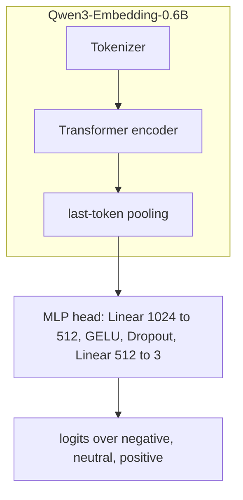

Let $x$ denote a review, $h_{\phi}(x) \in \mathbb{R}^{1024}$ the pooled embedding from the encoder with parameters $\phi$, and $g_{\psi}$ the MLP head with parameters $\psi$. Classifier logits:

$$f_{\theta}(x) = g_{\psi}(h_{\phi}(x)), \qquad \theta = (\phi, \psi).$$

Class probabilities:

$$p_{\theta}(y \mid x) = \mathrm{softmax}(f_{\theta}(x))_{y}.$$

## Classification Metric

All classification scores use the **multiclass Matthews Correlation Coefficient**. For confusion matrix $C \in \mathbb{N}^{K \times K}$ with $K=3$, row sums $t_k = \sum_j C_{kj}$, column sums $p_k = \sum_i C_{ik}$, and total $n = \sum_{i,j} C_{ij}$:

$$\mathrm{MCC} = \frac{n \sum_k C_{kk} - \sum_k t_k p_k}{\sqrt{\left(n^2 - \sum_k t_k^2\right)\left(n^2 - \sum_k p_k^2\right)}}.$$

$\mathrm{MCC} \in [-1,1]$. Values near 1 indicate strong correlation between predictions and ground truth across all classes. Values near 0 correspond to chance-level multiclass predictions.

## Unlearning Evaluation Metrics

For each unlearned model with parameters $\theta$ and frozen gold model $\theta_g$:

| Metric | Target |
| --- | --- |
| `model_retain_mcc` | Close to gold on retain test split, drop undesirable |
| `model_forget_mcc` | Low on forget test split, model forgot the forget class |
| `gold_kl_retain` | 0.0 |
| `gold_kl_forget` | 0.0 |
| `gold_agree_retain` | Maximal agreement with gold on retain test split |
| `gold_agree_forget` | Context-dependent agreement with gold on forget test split |

`gold_kl_retain`:

$$\mathbb{E}_{x \sim D_{r,\mathrm{test}}} \mathrm{KL}\left( p_{\theta_g}(\cdot \mid x) \Vert p_{\theta}(\cdot \mid x) \right)$$

`gold_kl_forget`:

$$\mathbb{E}_{x \sim D_{f,\mathrm{test}}} \mathrm{KL}\left( p_{\theta_g}(\cdot \mid x) \Vert p_{\theta}(\cdot \mid x) \right)$$

`gold_agree_retain`:

$$\mathbb{E}_{x \sim D_{r,\mathrm{test}}} \mathbb{I}\left( \arg\max_{y} p_{\theta}(y \mid x) = \arg\max_{y} p_{\theta_g}(y \mid x) \right)$$

`gold_agree_forget`:

$$\mathbb{E}_{x \sim D_{f,\mathrm{test}}} \mathbb{I}\left( \arg\max_{y} p_{\theta}(y \mid x) = \arg\max_{y} p_{\theta_g}(y \mid x) \right)$$

We save confusion matrices for **gold**, **original**, and the best unlearning checkpoint with lowest `model_forget_mcc` among methods whose `model_retain_mcc` is at least 90% of gold retain MCC.

## Baseline Training

We train **original** for one epoch on the full three-class split and **gold** for one epoch on retain data only. Both use cross-entropy loss:

$$L_{\mathrm{CE}}(\theta) = \mathbb{E}_{(x,y)\sim D_{\mathrm{train}}}\left[ -\log p_{\theta}(y \mid x) \right]$$

For gold, $D_{\mathrm{train}} = D_r$ and $y \in \{\mathrm{negative}, \mathrm{positive}\}$.

We compute metrics at epoch $0$ before any gradient step and every $0.1$ epoch on validation. Original is validated on the full valid split. Gold is validated on retain examples only. Original weights initialise unlearning. Gold weights stay frozen as the reference model.

$$\theta \leftarrow \theta - \eta \nabla_{\theta} L_{\mathrm{CE}}(\theta)$$

## Unlearning Methods

Cross-entropy on a labelled example:

$$\ell_{\mathrm{CE}}(x,y;\theta) = -\log p_{\theta}(y \mid x).$$

The original checkpoint is $\theta_0$.

### Retain Fine-Tuning

$$L_{\mathrm{retain}}(\theta) = \mathbb{E}_{(x,y)\sim D_r}\left[ \ell_{\mathrm{CE}}(x,y;\theta) \right]$$

$$\theta \leftarrow \theta - \eta \nabla_{\theta} L_{\mathrm{retain}}(\theta)$$

### DPO-like

Score for labelled example $(x,y)$:

$$s_{\theta}(x,y) = \beta\left( \log p_{\theta}(y \mid x) - \log p_{\theta_0}(y \mid x) \right)$$

For retain pair $(x_r, y_r)$ and forget pair $(x_f, y_f)$:

$$s_r = s_{\theta}(x_r, y_r), \qquad s_f = s_{\theta}(x_f, y_f)$$

$$L_{\mathrm{DPO}}(\theta) = -\mathbb{E}\left[ \log \sigma(s_r - s_f) \right]$$

$$\theta \leftarrow \theta - \eta \nabla_{\theta} L_{\mathrm{DPO}}(\theta)$$

with $\beta = 1$.

### RMU with Uniform Refusal Target

Uniform refusal distribution over $K=3$ classes:

$$u(y) = \frac{1}{K}$$

$$L_{\mathrm{retain}}^{\mathrm{RMU}}(\theta) = \mathbb{E}_{(x,y)\sim D_r}\left[ \ell_{\mathrm{CE}}(x,y;\theta) \right] + 0.5 \, \mathbb{E}_{x\sim D_r} \mathrm{KL}\left( p_{\theta_0}(\cdot \mid x) \Vert p_{\theta}(\cdot \mid x) \right)$$

$$L_{\mathrm{refusal}}(\theta) = \mathbb{E}_{x\sim D_f} \mathrm{KL}\left( u(\cdot) \Vert p_{\theta}(\cdot \mid x) \right)$$

$$L_{\mathrm{RMU}}(\theta) = L_{\mathrm{retain}}^{\mathrm{RMU}}(\theta) + L_{\mathrm{refusal}}(\theta)$$

$$\theta \leftarrow \theta - \eta \nabla_{\theta} L_{\mathrm{RMU}}(\theta)$$

### Random Target

We sample $\tilde{y} \sim \mathrm{Uniform}(Y_{\mathrm{retain}})$ where $Y_{\mathrm{retain}} = \{\mathrm{positive}, \mathrm{negative}\}$.

$$L_{\mathrm{random}}(\theta) = \mathbb{E}_{(x,y)\sim D_r}\left[ \ell_{\mathrm{CE}}(x,y;\theta) \right] + \gamma \, \mathbb{E}_{x\sim D_f,\, \tilde{y} \sim \mathrm{Uniform}(Y_{\mathrm{retain}})}\left[ \ell_{\mathrm{CE}}(x,\tilde{y};\theta) \right]$$

with $\gamma = 0.7$.

$$\theta \leftarrow \theta - \eta \nabla_{\theta} L_{\mathrm{random}}(\theta)$$

## Project Layout

```
qwen3-embedding-0.6b-unlearning/
├── main.py
├── schemas.py
├── constants.py
├── requirements.txt
├── dataset_token_stats.json
├── women_clothing_accessories.csv
├── figures/
│   └── token_length_distribution.png
├── data/
│   ├── splits.py
│   ├── dataset.py
│   └── token_stats.py
├── models/
│   └── classifier.py
├── metrics/
│   └── evaluation.py
├── training/
│   ├── losses.py
│   └── trainer.py
└── utils/
    ├── mlflow_utils.py
    ├── plotting.py
    ├── hf_upload.py
    └── github_results.py
results/
├── metrics/
├── figures/
└── predictions/
```

## Colab Pro Setup and Commands

Runtime: Google Colab Pro with NVIDIA L4 GPU, Python 3.10+.

```bash
git clone https://github.com/pymlex/qwen3-embedding-0.6b-unlearning.git
cd qwen3-embedding-0.6b-unlearning
pip install -r requirements.txt
```

We create `.env` from `.env.example`, fill `HF_TOKEN` and `GH_TOKEN`, then authenticate GitHub via browser and Hugging Face:

```bash
python main.py setup
```

Token length analysis, CSV separator conversion, histogram refresh:

```bash
python main.py analyze-dataset
```

Train, valid, test and retain or forget splits:

```bash
python main.py prepare-data
```

Gold and original models, one epoch, validation MCC at epoch 0, 0.1, 0.2, ..., 1.0:

```bash
python main.py train-baseline
```

All unlearning methods:

```bash
python main.py unlearn --method all
```

Single unlearning method:

```bash
python main.py unlearn --method rmu
```

Test MCC, unlearning metrics, confusion matrices, saved predictions:

```bash
python main.py evaluate
```

Rebuild confusion matrices from saved predictions without model inference:

```bash
python main.py replot-confusion
```

Checkpoint upload to Hugging Face:

```bash
python main.py push-hf
```

Metric tables, figures, and predictions to GitHub repository `results/`:

```bash
python main.py push-github
```

Full workflow:

```bash
python main.py run-all
```

MLflow tracking: `mlruns/`. Checkpoints and splits: `outputs/`. Published metrics, figures, and predictions: `results/`.

## Results

Experiments ran on Google Colab Pro with an NVIDIA L4 GPU, one training epoch for baselines and one unlearning epoch per method. Metric tables and figures are stored under [`results/`](results/).

### Three-class versus two-class performance

Gold reaches validation MCC $0.904$ and test MCC $0.893$ on the two-class retain task. Original reaches validation MCC $0.656$ and test MCC $0.633$ on the full three-class test split. The gap is not a training bug. Class **neutral** is inherently difficult in this corpus: many neutral reviews sit near the boundary between weak negative and weak positive polarity, and automatic labelling noise concentrates on this class.

On a balanced three-class test split, a predictor that handles `negative` and `positive` at gold quality but behaves as if **neutral** were unlearned yields multiclass MCC near $0.65$. That value is the reference floor for a model that never reliably identifies neutral. Original validation MCC $0.656$ exceeds this reference. Saved test predictions assign neutral to $37.6\%$ of examples, so original did learn neutral to a limited extent, not merely the two polar classes.

Removing neutral from training and evaluation collapses the task to binary sentiment. The head no longer needs to carve out a third decision region, and MCC rises to about $0.90$. The two headline numbers measure different tasks: three-class classification with a hard middle class, versus binary classification on polar reviews only.

### Baseline validation MCC

Gold converges quickly on retain validation. Original improves through epoch $0.4$ and then plateaus near $0.65$–$0.66$, consistent with the neutral-class ceiling above.

#### Baseline validation MCC over training

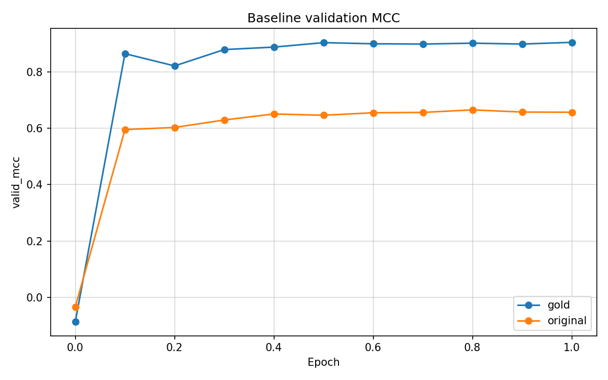

### Final test and unlearning metrics

All **multiclass MCC** entries in the table, namely `test_mcc` and `model_retain_mcc`, lie in $[-1,1]$ by construction.

Column `model_forget_mcc` is a separate score: the fraction of neutral argmax predictions on the forget test split, mapped to $[-1,1]$ only at the boundaries $0\%$ and $100\%$. When that fraction is close to zero or one but not exact, the mapping becomes numerically unstable and can return values outside $[-1,1]$. Treat $1.761$ for **original** and $-11.068$ for **rmu** as degenerate outputs, not as valid correlation coefficients. For **original**, high neutral mass on the forget split means forgetting has not occurred. For **rmu**, saved test predictions assign neutral to $0.13\%$ of examples, the same effective regime as **retain_ft** and **random_target**, which hit the capped value $-1.000$.

Gold retain MCC on the retain test split is $0.893$. Methods with `model_retain_mcc` at least $90\%$ of that value, i.e. $\geq 0.804$, pass the retain-quality gate.

| Model | test MCC | model_retain_mcc | model_forget_mcc | gold_kl_retain | gold_kl_forget | gold_agree_retain | gold_agree_forget |
| --- | --- | --- | --- | --- | --- | --- | --- |
| gold | $0.893$ | $0.893$ | $-1.000$ | $0.000$ | $0.000$ | $1.000$ | $1.000$ |
| original | $0.633$ | $0.676$ | $1.761$ | $0.021$ | $0.047$ | $0.787$ | $0.290$ |
| retain_ft | $0.521$ | $0.896$ | $-1.000$ | $0.065$ | $0.162$ | $0.966$ | $0.905$ |
| random_target | $0.521$ | $0.888$ | $-1.000$ | $0.088$ | $0.185$ | $0.966$ | $0.876$ |
| rmu | $0.523$ | $0.898$ | $-11.068$ | $0.090$ | $0.198$ | $0.962$ | $0.880$ |
| dpo_like | $0.456$ | $0.715$ | $-1.000$ | $0.232$ | $0.228$ | $0.859$ | $0.764$ |

**Best unlearning method: retain_ft.** Among checkpoints that pass the retain gate, **retain_ft**, **random_target**, and **rmu** all suppress neutral on the forget split and on the three-class test split. Saved predictions give neutral argmax rate $0.0\%$ for retain_ft and random_target and $0.13\%$ for rmu. The automatic rule in the pipeline ranks **rmu** first only because the raw forget score $-11.068$ lies outside the valid MCC range. After discarding that artefact, the three methods tie on forgetting. **retain_ft** leads on reference alignment: lowest `gold_kl_retain` at $0.065$ and highest `gold_agree_forget` at $0.905$, with `model_retain_mcc` $0.896$ within $0.002$ of **rmu**. **random_target** matches retain agreement on the retain split but is slightly farther from gold on KL and forget agreement. **dpo_like** fails the retain gate with `model_retain_mcc` $0.715$ and three-class test MCC $0.456$.

All successful unlearning checkpoints lower three-class `test_mcc` from $0.633$ to about $0.52$. That drop is expected once neutral argmax disappears on held-out neutral examples, even while retain-binary quality stays near gold.

Per-epoch unlearning traces live in [`results/metrics/`](results/metrics/).

### Confusion matrices on the three-class test split

#### Gold reference model

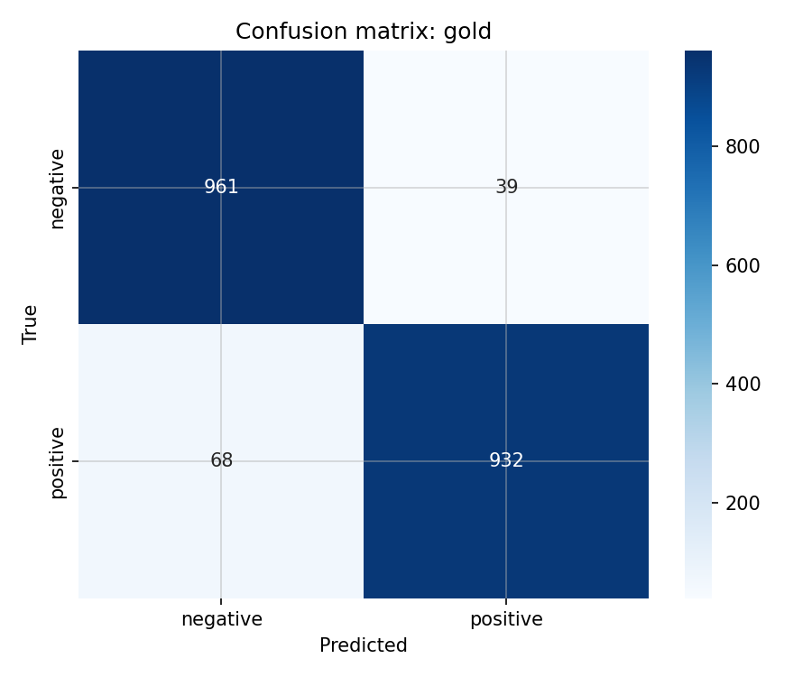

#### Original three-class baseline before unlearning

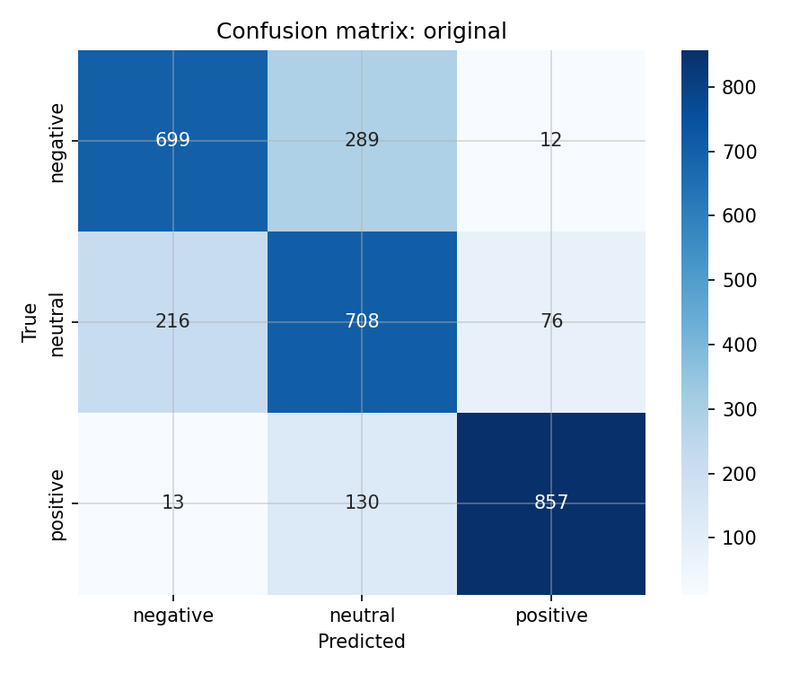

#### Best unlearning checkpoint (retain_ft)

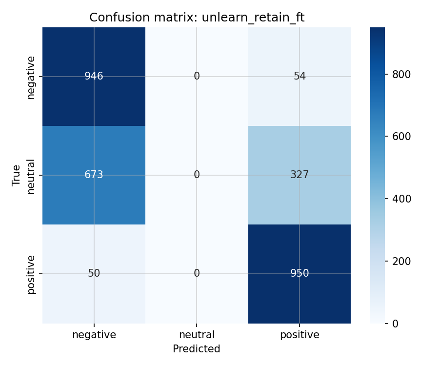

#### Retain fine-tuning


#### DPO-like unlearning

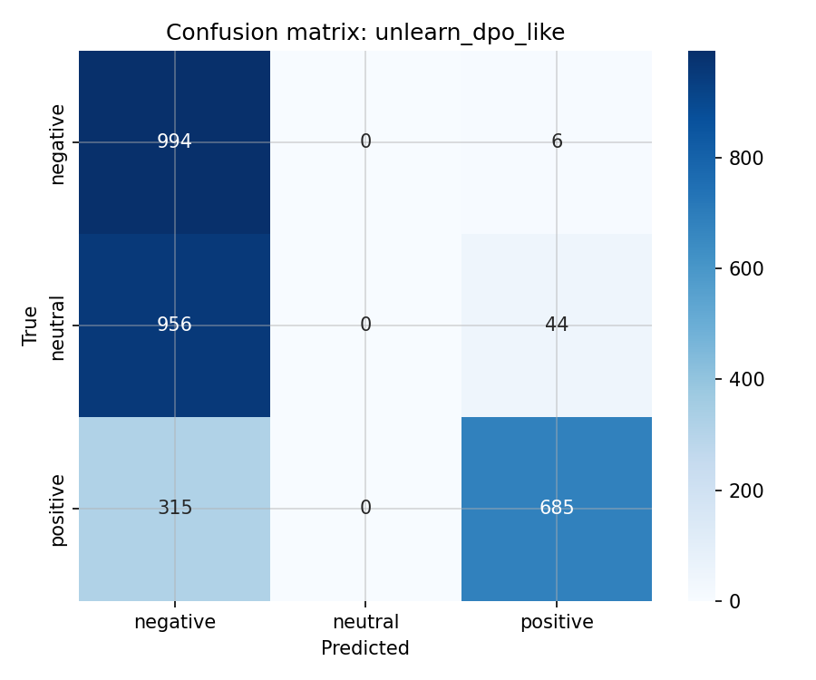

#### RMU unlearning

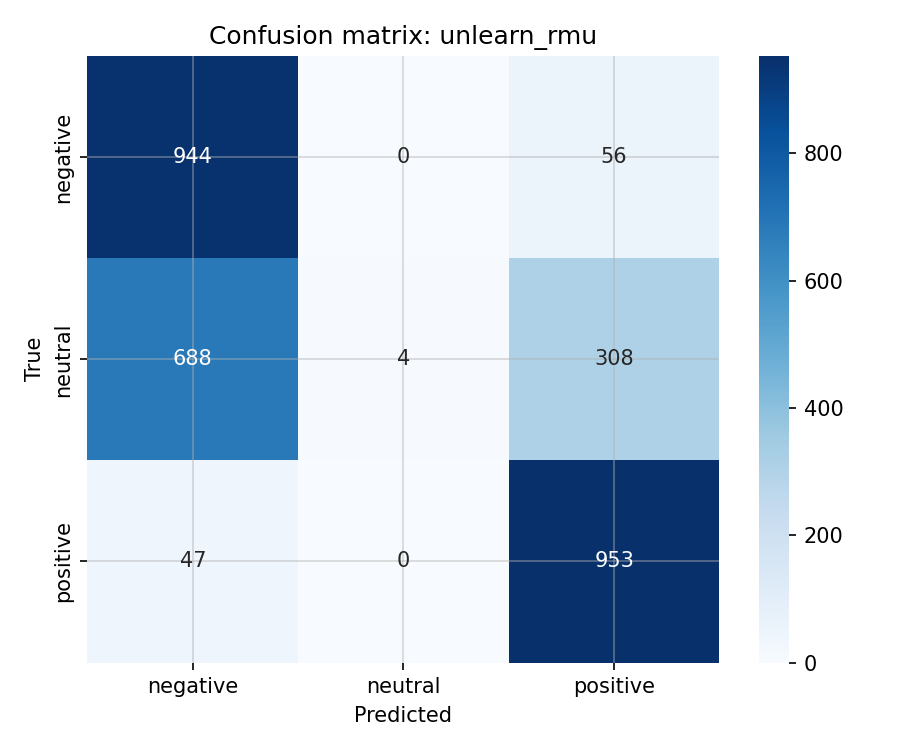

#### Random target unlearning

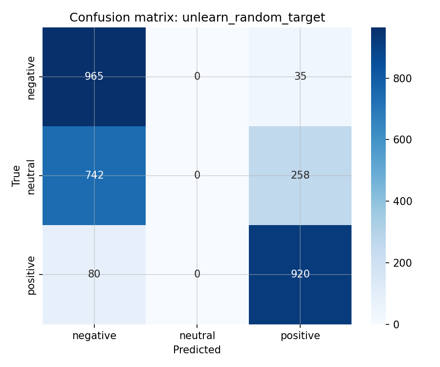

Original confuses neutral with both polar classes. Unlearned models route former neutral mass into `negative` and `positive`. Saved predictions confirm neutral argmax rate below $0.2\%$ for all three qualifying methods.

### Unlearning training curves

#### Retain fine-tuning — retain MCC during unlearning

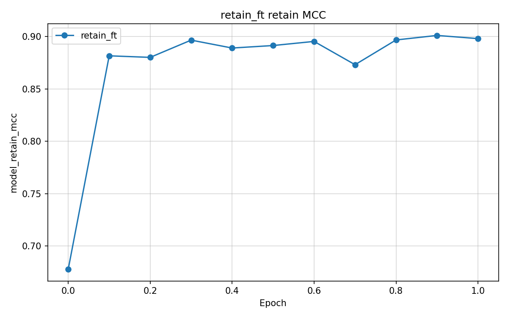

#### DPO-like — retain MCC during unlearning

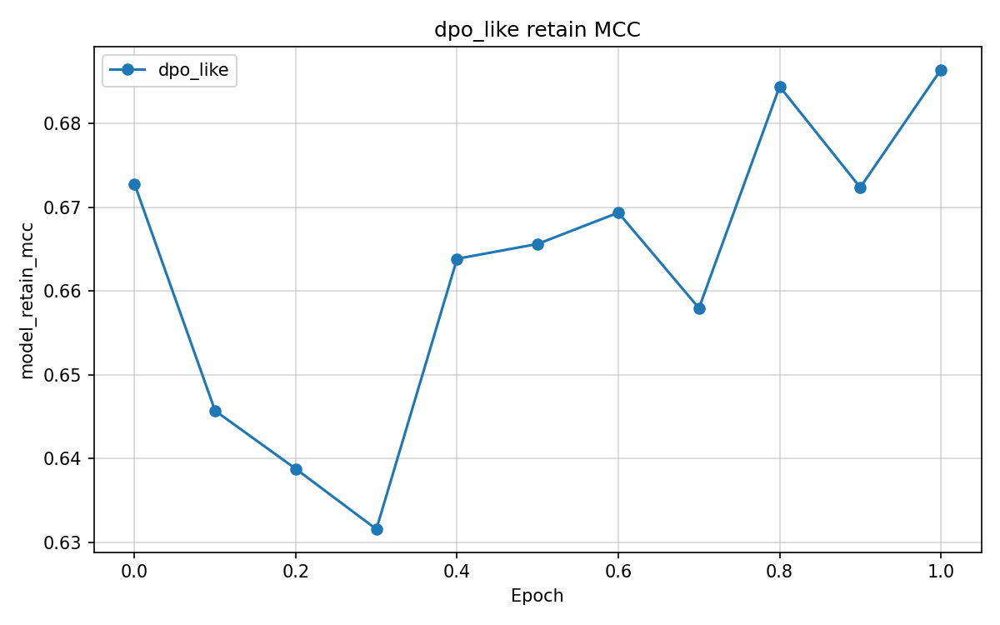

#### RMU — retain MCC during unlearning

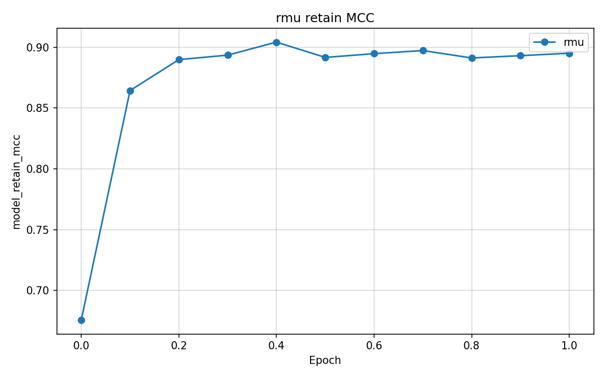

#### Random target — retain MCC during unlearning

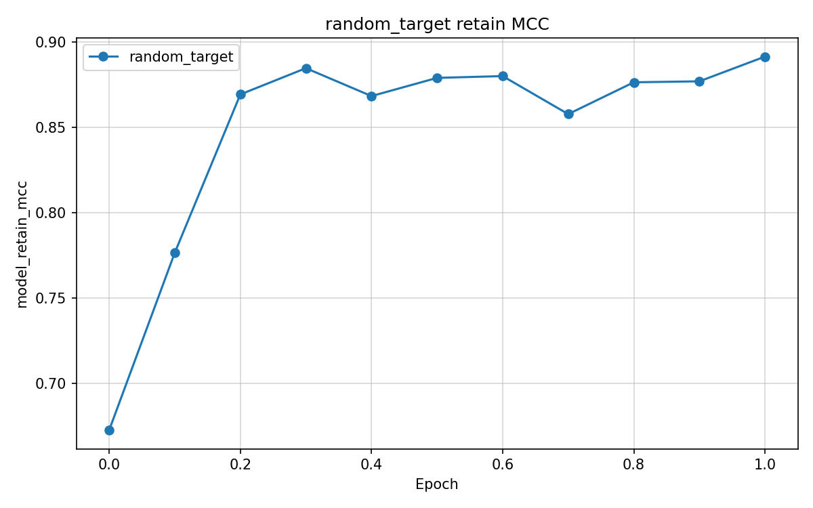

Retain MCC rises within the first $0.3$ epoch for retain_ft, random_target, and RMU. DPO-like keeps retain MCC near the original level and never reaches the gold retain gate.

## Hugging Face Checkpoints

Repository: [pymlex/qwen3-embedding-0.6b-unlearning](https://huggingface.co/pymlex/qwen3-embedding-0.6b-unlearning)

| Path | Description |
| --- | --- |
| `gold/` | Two-class reference model trained on retain data only |
| `original/` | Three-class baseline trained on the full train split |
| `unlearn/retain_ft/` | Retain fine-tuning checkpoint, selected as best |
| `unlearn/dpo_like/` | DPO-like unlearning checkpoint |
| `unlearn/rmu/` | RMU unlearning checkpoint |
| `unlearn/random_target/` | Random target unlearning checkpoint |

Each checkpoint folder has `encoder/` Hugging Face weights and `classifier.pt` MLP head state.

## Inference

Download the best unlearning checkpoint from Hugging Face and run three-class inference:

```python
from huggingface_hub import snapshot_download
import torch
from models.classifier import QwenEmbeddingClassifier

repo_dir = snapshot_download("pymlex/qwen3-embedding-0.6b-unlearning")
model = QwenEmbeddingClassifier.load_pretrained(
    f"{repo_dir}/unlearn/retain_ft",
    model_id="Qwen/Qwen3-Embedding-0.6B",
    num_classes=3,
    hidden_dim=512,
    max_length=128,
)
device = torch.device("cuda" if torch.cuda.is_available() else "cpu")
model.to(device).eval()

label_names = ["negative", "neutral", "positive"]
reviews = [
    "Платье пришло с браком, очень разочарована.",
    "Отличное качество, ношу каждый день.",
    "Нормальная вещь, ничего особенного.",
]

probs = model.predict_probs(reviews, device)
for review, prob_vector in zip(reviews, probs.cpu().numpy()):
    prediction = label_names[int(prob_vector.argmax())]
    print(review)
    print(f"  prediction: {prediction}")
    print(f"  probabilities: {dict(zip(label_names, prob_vector.round(3)))}")
```

Replace `unlearn/retain_ft` with `gold`, `original`, or another method folder. Gold checkpoints use `num_classes=2` and retain labels `negative`, `positive` only.

## Citation

If you found this project useful, please cite it as:

```bibtex
@software{zyukov2026qwen3unlearning,
  author  = {Zyukov, Alex},
  title   = {{Qwen3-Embedding-0.6B Unlearning}: Machine Unlearning for Russian Sentiment Classification},
  year    = {2026},
  url     = {https://github.com/pymlex/qwen3-embedding-0.6b-unlearning},
  version = {1.0},
  note    = {Hugging Face model pymlex/qwen3-embedding-0.6b-unlearning}
}
```

The code is under GPL-3.0 license.

## References

```bibtex
@article{qwen3embedding,
  title={Qwen3 Embedding: Advancing Text Embedding and Reranking Through Foundation Models},
  author={Zhang, Yanzhao and Li, Mingxin and Long, Dingkun and Zhang, Xin and Lin, Huan and Yang, Baosong and Xie, Pengjun and Yang, An and Liu, Dayiheng and Lin, Junyang and Huang, Fei and Zhou, Jingren},
  journal={arXiv preprint arXiv:2506.05176},
  year={2025}
}

@INPROCEEDINGS{Smetanin-SA-2019,
  author={Sergey Smetanin and Michail Komarov},
  booktitle={2019 IEEE 21st Conference on Business Informatics (CBI)},
  title={Sentiment Analysis of Product Reviews in Russian using Convolutional Neural Networks},
  year={2019},
  volume={01},
  pages={482-486},
  doi={10.1109/CBI.2019.00062}
}
```
