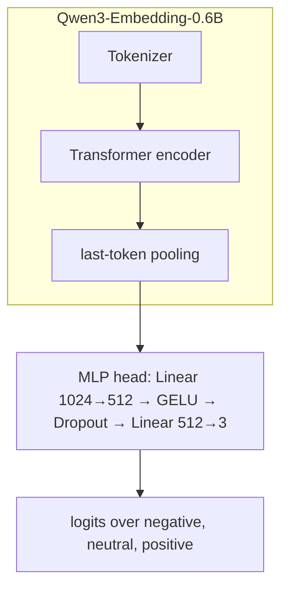

# Qwen3-Embedding-0.6B Machine Unlearning for Russian Sentiment Classification

Comparative study of machine unlearning methods applied to [Qwen/Qwen3-Embedding-0.6B](https://huggingface.co/Qwen/Qwen3-Embedding-0.6B) fine-tuned for three-class sentiment classification on Russian product reviews about women's clothing. The pipeline trains reference **gold** and **original** models, applies four unlearning objectives on a designated forget set, logs experiments with MLflow, uploads checkpoints to [pymlex/qwen3-embedding-0.6b-unlearning](https://huggingface.co/pymlex/qwen3-embedding-0.6b-unlearning), and reports multiclass Matthews Correlation Coefficient across retain and forget partitions.

## Overview

The dataset contains 90,000 automatically labelled reviews with three balanced classes: `negative`, `neutral`, and `positive`. Each class contributes 30,000 examples. The source corpus is the RuReviews women's clothing subset described in [sismetanin/rureviews](https://github.com/sismetanin/rureviews/tree/master). The project file `women_clothing_accessories.csv` is a local export used for training and evaluation.

Data partitioning per class:

| Split | Size per class | Role |
| --- | --- | --- |
| Train | 28,000 | Optimisation |
| Valid | 1,000 | Baseline validation MCC every 0.5 epoch |
| Test | 1,000 | Final evaluation and confusion matrices |

Machine unlearning targets the **negative** class. The retain set $D_r$ contains `positive` and `neutral` training examples. The forget set $D_f$ contains all `negative` training examples. The gold model is trained on the full three-class training split and kept frozen as the reference distribution for KL and agreement metrics.

## Model Architecture



Let $x$ denote a review, $h_\phi(x) \in \mathbb{R}^{1024}$ the pooled embedding from the frozen or fine-tuned encoder with parameters $\phi$, and $g_\psi$ the MLP head with parameters $\psi$. The classifier logits are

$$
f_\theta(x) = g_\psi(h_\phi(x)), \qquad \theta = (\phi, \psi).
$$

Class probabilities are $p_\theta(y \mid x) = \mathrm{softmax}(f_\theta(x))_y$.

## Classification Metric

All classification quality numbers use the **multiclass Matthews Correlation Coefficient**. For confusion matrix $C \in \mathbb{N}^{K \times K}$, $K=3$, define row sums $t_k = \sum_j C_{kj}$, column sums $p_k = \sum_i C_{ik}$, and total $n = \sum_{i,j} C_{ij}$. The multiclass MCC is

$$
\mathrm{MCC}
=
\frac{
  n \sum_k C_{kk}
  - \sum_k t_k p_k
}{
  \sqrt{
    \left(n^2 - \sum_k t_k^2\right)
    \left(n^2 - \sum_k p_k^2\right)
  }
}.
$$

$\mathrm{MCC} \in [-1,1]$. Values near 1 indicate strong correlation between predictions and ground truth across all classes. Values near 0 correspond to chance-level multiclass predictions.

## Unlearning Evaluation Metrics

For each unlearned model with parameters $\theta$ and frozen gold model $\theta_g$:

| Metric | Definition | Target |
| --- | --- | --- |
| `model_retain_mcc` | MCC on retain test split | Close to gold, drop undesirable |
| `model_forget_mcc` | MCC on forget test split | Low, model forgot the forget class |
| `gold_kl_retain` | $\mathbb{E}_{x \sim D_r^{\mathrm{test}}} \mathrm{KL}(p_{\theta_g}(\cdot \mid x)\,\|\,p_\theta(\cdot \mid x))$ | 0.0 |
| `gold_kl_forget` | $\mathbb{E}_{x \sim D_f^{\mathrm{test}}} \mathrm{KL}(p_{\theta_g}(\cdot \mid x)\,\|\,p_\theta(\cdot \mid x))$ | 0.0 |
| `gold_agree_retain` | $\mathbb{E}_{x \sim D_r^{\mathrm{test}}} \mathbf{1}[\arg\max p_\theta = \arg\max p_{\theta_g}]$ | Maximal |
| `gold_agree_forget` | $\mathbb{E}_{x \sim D_f^{\mathrm{test}}} \mathbf{1}[\arg\max p_\theta = \arg\max p_{\theta_g}]$ | Context-dependent |

Confusion matrices are saved for **gold**, **original**, and the **best unlearning** checkpoint selected by lowest `model_forget_mcc` among methods with `model_retain_mcc` at least 90% of gold retain MCC.

## Baseline Training

Both gold and original models are trained for two epochs on the full three-class training split with cross-entropy

$$
L_{\mathrm{CE}}(\theta)
=
\mathbb{E}_{(x,y)\sim D_{\mathrm{train}}}
\left[
-\log p_\theta(y \mid x)
\right].
$$

Metrics are computed at epoch $0$ before any gradient step and every $0.5$ epoch on the validation split. After training, gold weights are stored as the reference model. Original weights are an identical copy used as the starting point for unlearning.

**Update.**

$$
\theta \leftarrow \theta - \eta \nabla_\theta L_{\mathrm{CE}}(\theta).
$$

## Unlearning Methods

Let $\ell_{\mathrm{CE}}(x,y;\theta) = -\log p_\theta(y \mid x)$ and $\theta_0$ denote the original checkpoint.

### Retain Fine-Tuning

$$
L_{\mathrm{retain}}(\theta)
=
\mathbb{E}_{(x,y)\sim D_r}
\left[
\ell_{\mathrm{CE}}(x,y;\theta)
\right],
\qquad
\theta \leftarrow \theta - \eta \nabla_\theta L_{\mathrm{retain}}(\theta).
$$

### DPO-like

Define the implicit reward increment for labelled example $(x,y)$:

$$
s_\theta(x,y)
=
\beta
\left(
\log p_\theta(y \mid x)
-
\log p_{\theta_0}(y \mid x)
\right).
$$

For retain $(x_r, y_r)$ and forget $(x_f, y_f)$ pairs:

$$
s_r = s_\theta(x_r, y_r), \qquad s_f = s_\theta(x_f, y_f).
$$

The DPO-like objective prefers retain behaviour over forget behaviour:

$$
L_{\mathrm{DPO}}(\theta)
=
-\mathbb{E}
\left[
\log \sigma(s_r - s_f)
\right],
\qquad
\theta \leftarrow \theta - \eta \nabla_\theta L_{\mathrm{DPO}}(\theta),
$$

with $\beta = 0.1$.

### RMU with Uniform Refusal Target

Uniform refusal distribution over $K=3$ classes:

$$
u(y) = \frac{1}{K}.
$$

Retain preservation:

$$
L_{\mathrm{retain}}^{\mathrm{RMU}}(\theta)
=
\mathbb{E}_{(x,y)\sim D_r}
\left[
\ell_{\mathrm{CE}}(x,y;\theta)
\right]
+
0.5\,
\mathbb{E}_{x\sim D_r}
\left[
\mathrm{KL}
\left(
p_{\theta_0}(\cdot \mid x)
\,\|\,
p_\theta(\cdot \mid x)
\right)
\right].
$$

Forget refusal:

$$
L_{\mathrm{refusal}}(\theta)
=
\mathbb{E}_{x\sim D_f}
\left[
\mathrm{KL}
\left(
u(\cdot)
\,\|\,
p_\theta(\cdot \mid x)
\right)
\right].
$$

Combined loss and update:

$$
L_{\mathrm{RMU}}(\theta)
=
L_{\mathrm{retain}}^{\mathrm{RMU}}(\theta)
+
L_{\mathrm{refusal}}(\theta),
\qquad
\theta \leftarrow \theta - \eta \nabla_\theta L_{\mathrm{RMU}}(\theta).
$$

### Random Target

Sample $\tilde{y} \sim \mathrm{Uniform}(Y_{\mathrm{retain}})$ where $Y_{\mathrm{retain}} = \{\mathrm{positive}, \mathrm{neutral}\}$.

$$
L_{\mathrm{random}}(\theta)
=
\mathbb{E}_{(x,y)\sim D_r}
\left[
\ell_{\mathrm{CE}}(x,y;\theta)
\right]
+
\gamma\,
\mathbb{E}_{x\sim D_f,\, \tilde y \sim \mathrm{Uniform}(Y_{\mathrm{retain}})}
\left[
\ell_{\mathrm{CE}}(x,\tilde y;\theta)
\right],
\qquad
\gamma = 0.7,
$$

$$
\theta \leftarrow \theta - \eta \nabla_\theta L_{\mathrm{random}}(\theta).
$$

## Project Layout

```
qwen3-embedding-0.6b-unlearning/
├── main.py                     # CLI entry point
├── schemas.py                  # Pydantic configuration
├── constants.py                # Label mappings
├── requirements.txt
├── women_clothing_accessories.csv
├── data/
│   ├── splits.py               # Train, valid, test, retain, forget splits
│   └── dataset.py              # PyTorch datasets and collators
├── models/
│   └── classifier.py           # Qwen encoder + MLP head
├── metrics/
│   └── evaluation.py           # MCC, KL, agreement, confusion matrix inputs
├── training/
│   ├── losses.py               # Unlearning objectives
│   └── trainer.py              # Baseline and unlearning loops
└── utils/
    ├── mlflow_utils.py
    ├── plotting.py
    └── hf_upload.py
```

## Colab Pro Setup and Commands

Runtime: Google Colab Pro with NVIDIA L4 GPU, Python 3.10+.

```bash
git clone https://github.com/pymlex/qwen3-embedding-0.6b-unlearning.git
cd qwen3-embedding-0.6b-unlearning
pip install -r requirements.txt
export HF_TOKEN=<your_huggingface_token>
```

Prepare splits:

```bash
python main.py prepare-data
```

Train gold and original models for two epochs with validation MCC at epoch 0, 0.5, 1.0, 1.5, 2.0:

```bash
python main.py train-baseline
```

Run all unlearning methods:

```bash
python main.py unlearn --method all
```

Run a single method:

```bash
python main.py unlearn --method rmu
```

Evaluate test MCC, unlearning metrics, and confusion matrices:

```bash
python main.py evaluate
```

Upload checkpoints to Hugging Face:

```bash
python main.py push-hf
```

Full pipeline in one command:

```bash
python main.py run-all
```

MLflow tracking directory: `mlruns/`. Figures and CSV summaries: `outputs/`.

## Results

Tables below are populated after the full Colab training run. Re-run `python main.py evaluate` and copy values from `outputs/final_evaluation.csv`.

### Baseline validation MCC

| Epoch | Gold valid MCC | Original valid MCC |
| --- | --- | --- |
| 0.0 | pending | pending |
| 0.5 | pending | pending |
| 1.0 | pending | pending |
| 1.5 | pending | pending |
| 2.0 | pending | pending |

### Final test and unlearning metrics

| Model | test MCC | model_retain_mcc | model_forget_mcc | gold_kl_retain | gold_kl_forget | gold_agree_retain | gold_agree_forget |
| --- | --- | --- | --- | --- | --- | --- | --- |
| gold | pending | pending | pending | pending | pending | pending | pending |
| original | pending | pending | pending | pending | pending | pending | pending |
| retain_ft | pending | pending | pending | pending | pending | pending | pending |
| dpo_like | pending | pending | pending | pending | pending | pending | pending |
| rmu | pending | pending | pending | pending | pending | pending | pending |
| random_target | pending | pending | pending | pending | pending | pending | pending |

### Confusion matrices

After evaluation, figures are written to `outputs/figures/`:

- `confusion_gold.png`
- `confusion_original.png`
- `confusion_best_unlearn.png`

### Training curves

- `outputs/figures/baseline_valid_mcc.png`
- `outputs/figures/{method}_retain_mcc.png`
- `outputs/figures/{method}_forget_mcc.png`

## Hugging Face Checkpoints

Repository: [pymlex/qwen3-embedding-0.6b-unlearning](https://huggingface.co/pymlex/qwen3-embedding-0.6b-unlearning)

| Path | Description |
| --- | --- |
| `gold/` | Reference model after two-epoch full-data training |
| `original/` | Copy of gold used as unlearning initialization |
| `unlearn/retain_ft/` | Retain fine-tuning checkpoint |
| `unlearn/dpo_like/` | DPO-like unlearning checkpoint |
| `unlearn/rmu/` | RMU unlearning checkpoint |
| `unlearn/random_target/` | Random target unlearning checkpoint |

Each folder contains `encoder/` Hugging Face weights and `classifier.pt` MLP head state.

## References

```bibtex
@article{qwen3embedding,
  title={Qwen3 Embedding: Advancing Text Embedding and Reranking Through Foundation Models},
  author={Zhang, Yanzhao and Li, Mingxin and Long, Dingkun and Zhang, Xin and Lin, Huan and Yang, Baosong and Xie, Pengjun and Yang, An and Liu, Dayiheng and Lin, Junyang and Huang, Fei and Zhou, Jingren},
  journal={arXiv preprint arXiv:2506.05176},
  year={2025}
}

@INPROCEEDINGS{Smetanin-SA-2019,
  author={Sergey Smetanin and Michail Komarov},
  booktitle={2019 IEEE 21st Conference on Business Informatics (CBI)},
  title={Sentiment Analysis of Product Reviews in Russian using Convolutional Neural Networks},
  year={2019},
  volume={01},
  pages={482-486},
  doi={10.1109/CBI.2019.00062}
}

@misc{qwen3_embedding_unlearning_2026,
  author={Alex Zyukov},
  title={Qwen3-Embedding-0.6B Machine Unlearning for Russian Sentiment Classification},
  year={2026},
  publisher={GitHub},
  url={https://github.com/pymlex/qwen3-embedding-0.6b-unlearning}
}
```

The project is under GPL-3.0 license.
