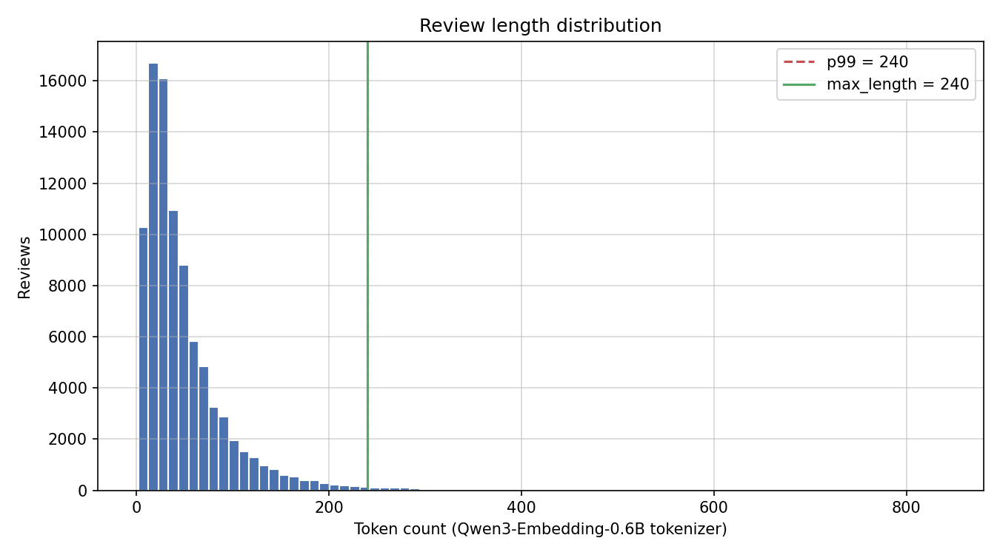
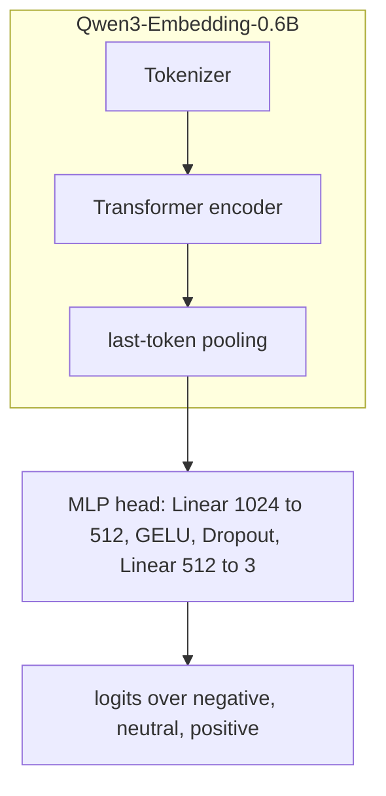

# Qwen3-Embedding-0.6B Machine Unlearning for Russian Sentiment Classification

We compare machine unlearning methods on [Qwen/Qwen3-Embedding-0.6B](https://huggingface.co/Qwen/Qwen3-Embedding-0.6B) fine-tuned for three-class sentiment classification on Russian product reviews about women's clothing. We train **gold** and **original** reference models, apply four unlearning objectives on a designated forget set, log experiments with MLflow, upload checkpoints to [pymlex/qwen3-embedding-0.6b-unlearning](https://huggingface.co/pymlex/qwen3-embedding-0.6b-unlearning), and report multiclass Matthews Correlation Coefficient on retain and forget partitions.

## Overview

90,000 automatically labelled reviews with three balanced classes: `negative`, `neutral`, and `positive`. Each class contributes 30,000 examples. The source corpus is the RuReviews women's clothing subset from [sismetanin/rureviews](https://github.com/sismetanin/rureviews/tree/master). We use `women_clothing_accessories.csv`, a comma-separated export, for training and evaluation.

We forget the **neutral** class. The retain set $D_r$ holds `negative` and `positive` training examples. The forget set $D_f$ holds all `neutral` training examples.

We train **original** on the full three-class split with a three-logit head. We train **gold** on $D_r$ only with a two-logit head over `negative` and `positive`. Gold is frozen as the reference for KL and agreement metrics during unlearning.

## Dataset

We measure token lengths with the [Qwen/Qwen3-Embedding-0.6B](https://huggingface.co/Qwen/Qwen3-Embedding-0.6B) tokenizer over all 90,000 reviews without truncation.

| Statistic | Tokens |
| --- | --- |
| Mean | 49.3 |
| Median | 35 |
| p95 | 139 |
| p99 | 240 |
| Maximum | 838 |

Corpus $p_{99}$ token length is 240. We fix the sequence budget at `max_length = 128`. Reviews longer than this are truncated in training and inference.



We hold out 1,000 test and 1,000 validation examples per class. All remaining examples go to train.

| Split | Size per class | Total | Role |
| --- | --- | --- | --- |
| Train | 15,000 | 45,000 | Optimisation |
| Valid | 1,000 | 3,000 | Baseline validation MCC every 0.1 epoch |
| Test | 1,000 | 3,000 | Final evaluation and confusion matrices |

After the class split, retain training has 30,000 reviews and forget training has 15,000 neutral reviews.

## Model Architecture



Let $x$ denote a review, $h_{\phi}(x) \in \mathbb{R}^{1024}$ the pooled embedding from the encoder with parameters $\phi$, and $g_{\psi}$ the MLP head with parameters $\psi$. Classifier logits:

$$f_{\theta}(x) = g_{\psi}(h_{\phi}(x)), \qquad \theta = (\phi, \psi).$$

Class probabilities:

$$p_{\theta}(y \mid x) = \mathrm{softmax}(f_{\theta}(x))_{y}.$$

## Classification Metric

All classification scores use the **multiclass Matthews Correlation Coefficient**. For confusion matrix $C \in \mathbb{N}^{K \times K}$ with $K=3$, row sums $t_k = \sum_j C_{kj}$, column sums $p_k = \sum_i C_{ik}$, and total $n = \sum_{i,j} C_{ij}$:

$$\mathrm{MCC} = \frac{n \sum_k C_{kk} - \sum_k t_k p_k}{\sqrt{\left(n^2 - \sum_k t_k^2\right)\left(n^2 - \sum_k p_k^2\right)}}.$$

$\mathrm{MCC} \in [-1,1]$. Values near 1 indicate strong correlation between predictions and ground truth across all classes. Values near 0 correspond to chance-level multiclass predictions.

## Unlearning Evaluation Metrics

For each unlearned model with parameters $\theta$ and frozen gold model $\theta_g$:

| Metric | Target |
| --- | --- |
| `model_retain_mcc` | Close to gold on retain test split, drop undesirable |
| `model_forget_mcc` | Low on forget test split, model forgot the forget class |
| `gold_kl_retain` | 0.0 |
| `gold_kl_forget` | 0.0 |
| `gold_agree_retain` | Maximal agreement with gold on retain test split |
| `gold_agree_forget` | Context-dependent agreement with gold on forget test split |

`gold_kl_retain`:

$$\mathbb{E}_{x \sim D_{r,\mathrm{test}}} \mathrm{KL}\left( p_{\theta_g}(\cdot \mid x) \Vert p_{\theta}(\cdot \mid x) \right)$$

`gold_kl_forget`:

$$\mathbb{E}_{x \sim D_{f,\mathrm{test}}} \mathrm{KL}\left( p_{\theta_g}(\cdot \mid x) \Vert p_{\theta}(\cdot \mid x) \right)$$

`gold_agree_retain`:

$$\mathbb{E}_{x \sim D_{r,\mathrm{test}}} \mathbb{I}\left( \arg\max_{y} p_{\theta}(y \mid x) = \arg\max_{y} p_{\theta_g}(y \mid x) \right)$$

`gold_agree_forget`:

$$\mathbb{E}_{x \sim D_{f,\mathrm{test}}} \mathbb{I}\left( \arg\max_{y} p_{\theta}(y \mid x) = \arg\max_{y} p_{\theta_g}(y \mid x) \right)$$

We save confusion matrices for **gold**, **original**, and the best unlearning checkpoint with lowest `model_forget_mcc` among methods whose `model_retain_mcc` is at least 90% of gold retain MCC.

## Baseline Training

We train gold and original models for two epochs on the full three-class split with cross-entropy loss:

$$L_{\mathrm{CE}}(\theta) = \mathbb{E}_{(x,y)\sim D_{\mathrm{train}}}\left[ -\log p_{\theta}(y \mid x) \right]$$

For gold, $D_{\mathrm{train}} = D_r$ and $y \in \{\mathrm{negative}, \mathrm{positive}\}$.

We compute metrics at epoch $0$ before any gradient step and every $0.1$ epoch on validation. Original is validated on the full valid split. Gold is validated on retain examples only. Original weights initialise unlearning. Gold weights stay frozen as the reference model.

$$\theta \leftarrow \theta - \eta \nabla_{\theta} L_{\mathrm{CE}}(\theta)$$

## Unlearning Methods

Cross-entropy on a labelled example:

$$\ell_{\mathrm{CE}}(x,y;\theta) = -\log p_{\theta}(y \mid x).$$

The original checkpoint is $\theta_0$.

### Retain Fine-Tuning

$$L_{\mathrm{retain}}(\theta) = \mathbb{E}_{(x,y)\sim D_r}\left[ \ell_{\mathrm{CE}}(x,y;\theta) \right]$$

$$\theta \leftarrow \theta - \eta \nabla_{\theta} L_{\mathrm{retain}}(\theta)$$

### DPO-like

Score for labelled example $(x,y)$:

$$s_{\theta}(x,y) = \beta\left( \log p_{\theta}(y \mid x) - \log p_{\theta_0}(y \mid x) \right)$$

For retain pair $(x_r, y_r)$ and forget pair $(x_f, y_f)$:

$$s_r = s_{\theta}(x_r, y_r), \qquad s_f = s_{\theta}(x_f, y_f)$$

$$L_{\mathrm{DPO}}(\theta) = -\mathbb{E}\left[ \log \sigma(s_r - s_f) \right]$$

$$\theta \leftarrow \theta - \eta \nabla_{\theta} L_{\mathrm{DPO}}(\theta)$$

with $\beta = 1$.

### RMU with Uniform Refusal Target

Uniform refusal distribution over $K=3$ classes:

$$u(y) = \frac{1}{K}$$

$$L_{\mathrm{retain}}^{\mathrm{RMU}}(\theta) = \mathbb{E}_{(x,y)\sim D_r}\left[ \ell_{\mathrm{CE}}(x,y;\theta) \right] + 0.5 \, \mathbb{E}_{x\sim D_r} \mathrm{KL}\left( p_{\theta_0}(\cdot \mid x) \Vert p_{\theta}(\cdot \mid x) \right)$$

$$L_{\mathrm{refusal}}(\theta) = \mathbb{E}_{x\sim D_f} \mathrm{KL}\left( u(\cdot) \Vert p_{\theta}(\cdot \mid x) \right)$$

$$L_{\mathrm{RMU}}(\theta) = L_{\mathrm{retain}}^{\mathrm{RMU}}(\theta) + L_{\mathrm{refusal}}(\theta)$$

$$\theta \leftarrow \theta - \eta \nabla_{\theta} L_{\mathrm{RMU}}(\theta)$$

### Random Target

We sample $\tilde{y} \sim \mathrm{Uniform}(Y_{\mathrm{retain}})$ where $Y_{\mathrm{retain}} = \{\mathrm{positive}, \mathrm{negative}\}$.

$$L_{\mathrm{random}}(\theta) = \mathbb{E}_{(x,y)\sim D_r}\left[ \ell_{\mathrm{CE}}(x,y;\theta) \right] + \gamma \, \mathbb{E}_{x\sim D_f,\, \tilde{y} \sim \mathrm{Uniform}(Y_{\mathrm{retain}})}\left[ \ell_{\mathrm{CE}}(x,\tilde{y};\theta) \right]$$

with $\gamma = 0.7$.

$$\theta \leftarrow \theta - \eta \nabla_{\theta} L_{\mathrm{random}}(\theta)$$

## Project Layout

```
qwen3-embedding-0.6b-unlearning/
├── main.py
├── schemas.py
├── constants.py
├── requirements.txt
├── dataset_token_stats.json
├── women_clothing_accessories.csv
├── figures/
│   └── token_length_distribution.png
├── data/
│   ├── splits.py
│   ├── dataset.py
│   └── token_stats.py
├── models/
│   └── classifier.py
├── metrics/
│   └── evaluation.py
├── training/
│   ├── losses.py
│   └── trainer.py
└── utils/
    ├── mlflow_utils.py
    ├── plotting.py
    └── hf_upload.py
```

## Colab Pro Setup and Commands

Runtime: Google Colab Pro with NVIDIA L4 GPU, Python 3.10+.

```bash
git clone https://github.com/pymlex/qwen3-embedding-0.6b-unlearning.git
cd qwen3-embedding-0.6b-unlearning
pip install -r requirements.txt
```

We create `.env` from `.env.example`, fill `HF_TOKEN` and `GH_TOKEN`, then authenticate GitHub via browser and Hugging Face:

```bash
python main.py setup
```

Token length analysis, CSV separator conversion, histogram refresh:

```bash
python main.py analyze-dataset
```

Train, valid, test and retain or forget splits:

```bash
python main.py prepare-data
```

Gold and original models, one epoch, validation MCC at epoch 0, 0.1, 0.2, ..., 1.0:

```bash
python main.py train-baseline
```

All unlearning methods:

```bash
python main.py unlearn --method all
```

Single unlearning method:

```bash
python main.py unlearn --method rmu
```

Test MCC, unlearning metrics, confusion matrices:

```bash
python main.py evaluate
```

Checkpoint upload to Hugging Face:

```bash
python main.py push-hf
```

Full workflow:

```bash
python main.py run-all
```

MLflow tracking: `mlruns/`. Training figures and CSV summaries: `outputs/`.

## Results

We fill the tables below after the Colab training run. Copy values from `outputs/final_evaluation.csv` after `python main.py evaluate`.

### Baseline validation MCC

| Epoch | Gold valid MCC | Original valid MCC |
| --- | --- | --- |
| 0.0 | pending | pending |
| 0.5 | pending | pending |
| 1.0 | pending | pending |

### Final test and unlearning metrics

| Model | test MCC | model_retain_mcc | model_forget_mcc | gold_kl_retain | gold_kl_forget | gold_agree_retain | gold_agree_forget |
| --- | --- | --- | --- | --- | --- | --- | --- |
| gold | pending | pending | pending | pending | pending | pending | pending |
| original | pending | pending | pending | pending | pending | pending | pending |
| retain_ft | pending | pending | pending | pending | pending | pending | pending |
| dpo_like | pending | pending | pending | pending | pending | pending | pending |
| rmu | pending | pending | pending | pending | pending | pending | pending |
| random_target | pending | pending | pending | pending | pending | pending | pending |

### Confusion matrices

We write figures to `outputs/figures/`:

- `confusion_gold.png`
- `confusion_original.png`
- `confusion_best_unlearn.png`

### Training curves

- `outputs/figures/baseline_valid_mcc.png`
- `outputs/figures/{method}_retain_mcc.png`
- `outputs/figures/{method}_forget_mcc.png`

## Hugging Face Checkpoints

Repository: [pymlex/qwen3-embedding-0.6b-unlearning](https://huggingface.co/pymlex/qwen3-embedding-0.6b-unlearning)

| Path | Description |
| --- | --- |
| `gold/` | Reference model after two-epoch full-data training |
| `original/` | Copy of gold used as unlearning initialization |
| `unlearn/retain_ft/` | Retain fine-tuning checkpoint |
| `unlearn/dpo_like/` | DPO-like unlearning checkpoint |
| `unlearn/rmu/` | RMU unlearning checkpoint |
| `unlearn/random_target/` | Random target unlearning checkpoint |

Each checkpoint folder has `encoder/` Hugging Face weights and `classifier.pt` MLP head state.

## Citation

If you found this project useful, please cite it as:

```bibtex
@software{zyukov2026qwen3unlearning,
  author  = {Zyukov, Alex},
  title   = {{Qwen3-Embedding-0.6B Unlearning}: Machine Unlearning for Russian Sentiment Classification},
  year    = {2026},
  url     = {https://github.com/pymlex/qwen3-embedding-0.6b-unlearning},
  version = {1.0},
  note    = {Hugging Face model pymlex/qwen3-embedding-0.6b-unlearning}
}
```

The code is under GPL-3.0 license.

## References

```bibtex
@article{qwen3embedding,
  title={Qwen3 Embedding: Advancing Text Embedding and Reranking Through Foundation Models},
  author={Zhang, Yanzhao and Li, Mingxin and Long, Dingkun and Zhang, Xin and Lin, Huan and Yang, Baosong and Xie, Pengjun and Yang, An and Liu, Dayiheng and Lin, Junyang and Huang, Fei and Zhou, Jingren},
  journal={arXiv preprint arXiv:2506.05176},
  year={2025}
}

@INPROCEEDINGS{Smetanin-SA-2019,
  author={Sergey Smetanin and Michail Komarov},
  booktitle={2019 IEEE 21st Conference on Business Informatics (CBI)},
  title={Sentiment Analysis of Product Reviews in Russian using Convolutional Neural Networks},
  year={2019},
  volume={01},
  pages={482-486},
  doi={10.1109/CBI.2019.00062}
}
```
